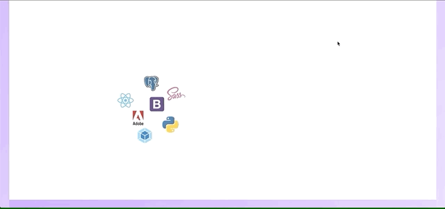

# 

<h1>Personal Project Two: Mini Projects</h1>

<h2>Goal: Learn about and use libraries and technologies by creating small projects</h2>

| Contents                      |                |
| ------------------------------|----------------|
|1. [Overview](#overview)       |6. [Future content](#future)
|2. [Brief](#brief)             |7. [Wins](#wins)
|3. [Technologies used](#tech)  |8. [Blockers](#blockers)
|4. [App](#app)                 |9. [Bugs](#bugs)
|5. [Approach](#approach)       |10. [Future learnings](#learn)

<h2 name='overview'>Overview</h2>

<h3>Introduction</h3>
In my first small project I built an app that allows the user to send a message directly to my phone in over 90 languages using Twilio and Yandex.


In my second project I used Adam Janes Introduction to D3.js with React to build an interactive and updating scatterplot and barchart, I have also experimented with ways to display images in D3.

<h3>Deployment</h3>

The app is deployed on Heroku and can be found here: https://small-project-libraries.herokuapp.com/ <br>

<h3>Timeframe</h3>

4 days

<h2 name='brief'>Brief</h2>

* **Receive a text sent via Twilio**
* **Translate the text into another language**
* **Build a D3 graph in a react environment**
* **Have the graph update**

<h2 name='tech'>Technologies used</h2>
<p>1. HTML5 <br>
2. SCSS & Bulma & Bootstrap <br>
3. JavaScript (ES6) <br>
4. JSON <br>
5. React.js <br>
6. Node.js <br>
7. Express.js <br>
8. Axios <br>
9. Insomnia <br>
10. Dotenv <br>
11. D3 <br>
12. Twilio <br>
13. Yandex <br>
14. Z shell <br>
15. Yarn <br>
16. Heroku <br>
17. GitHub <br><p/>

<h2 name='app'>App</h2>

In the case of the Twilio and Yandex app the user can type in anything, then translate that into any language from the list below. Once the user is happy with their translation they can send it to me as a text message.<br>
<br>
<br>

<br>
<br>
<br>

<br>
<br>
<br>
With D3 in React the Scatterplot works with the table to its right, dynamically displaying its data and changing axis, when you add or remove data.<br>
<br>
<br>

<br>
<br>
<br>
The Bar chart dynamically updates via the drop down selection.<br>
<br>
<br>

<br>
<br>
<br>
Below the Bar chart is a quick experiment to display images via D3.<br>
<br>
<br>

<br>
<br>
<br>
<h2 name='approach'>Approach</h2>
Starting with D3 in React I knew I had to do some research for this as D3 in React is very complicated due to the fact they both try to render the DOM causing bugs. I therefore took the Introduction to D3.js with React Udemy course by Adam Janes.<br>
<br>
<br>

<br>
<br>
<br>
In the case of Twilio and Yandex I looked up the documentation for each and acquired the necessary codes by signing up. Twilio works with Express so I therefore needed to set up a back end for this part. 
<h2 name='future'>Future content</h2>
<h3>Images</h3>
I would like to make the image display with D3 more interactive<br>
<br>
<br>
<h2 name='wins'>Wins</h2>
<h3>D3 wrapper</h3>
Learning how to wrap D3 was really insightful as I learned you can control if your component updates via the named method, but you can still pass down props.

```javascript
export default class ChartWrapper extends Component {
  componentDidMount() {
    this.setState({
      barchart: new D3Chart2(this.refs.chart2),
      chart: new D3Chart(this.refs.chart1, this.props.data, this.props.updateName)
    })
  }

  shouldComponentUpdate() {
    return false
  }

  componentWillReceiveProps(nextProps) {
    this.state.chart.update(nextProps.data)
    this.state.barchart.update(nextProps.gender)
  }

  render() {
    return (
      <div>
        <div className="chart-area" ref="chart1"></div>
        <hr />
        <h4>Updating a chart via user input</h4>
        <div ref='chart2'></div>
      </div>
    )
  }
}
```
<br>
<br>
<br>
<h3>General Update Pattern</h3>
D3 has a general update pattern that is unintuitive and confusing, I still have a lot to learn with D3 but understanding the basics like you need to select the rectangles before they are created is a big win.

```javascript
    //DATA JOIN
    const rects = vis.svg.selectAll('rect')
      .data(vis.data)

    //EXIT
    rects.exit()
      .transition().duration(500)
      .attr('height', 0)
      .attr('y', HEIGHT)
      .remove()

    //UPDATE
    rects.transition().duration(500)
      .attr('x', d => x(d.name))
      .attr('y', d => y(d.height))
      .attr('width', x.bandwidth)
      .attr('height', d => HEIGHT - y(d.height))

    //ENTER
    rects.enter().append('rect')
      .attr('x', d => x(d.name))
      .attr('width', x.bandwidth)
      .attr('fill', 'grey')
      .attr('y', HEIGHT)
      .transition().duration(500)
      .attr('y', d => y(d.height))
      .attr('height', d => HEIGHT - y(d.height))
```
<br>
<br>
<br>
<h3>DotEnv</h3>
Getting to grips with environment variables was a bit tricky to begin with but being forced to use them in both the front and back end has given me a good understanding of their setup in a local environment and on pages such as Heroku.<br>
<br>
<br>
<h2 name='blockers'>Blockers</h2>
<h3>D3 Images</h3>
Placing Images in a chart proved to be a steep learning curve. I managed to cobble together a simple animation to display the images, however getting to this point was difficult and I still do not fully understand how it all works<br>
<br>
<br>
<h3>D3 wrapper</h3>
Although the D3 wrapper works, some of the code I was told to use is no longer considered safe, and I'm unsure how to update these parts. Also the component will receive props method could not be used with other graphs I attempted to create, as I don't understand it properly.<br>
<br>
<br>
<h2 name='bugs'>Bugs</h2>
<h3>Scatter Plot</h3>
The user can enter only one or two bits of information to the chart and it will update causing a bug. This is easily fixed with a conditional piece of code that will only send through the information when all three sections have been filled.<br>
<br>
<br>

<br>
<br>
<h3>Images</h3>
During a short period after rendering, if the user clicks the center image, all the images will switch positions. Also the only image you can interact with is the center one. At my current understanding of D3 I do not understand why this is happening.<br>
<br>
<br>

<br>
<br>
<h2 name='learn'>Future learnings</h2>
• Work with D3 more<br>
• Look into built in methods of react<br>


